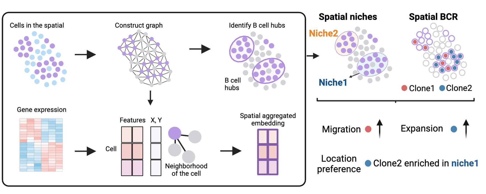

# B-HIT

**A bioinformatics tool for joint analysis of spatial BCR and transcriptomic data.**




## Background

  B cell Hub Identification and B cell Tracking by BCR


## Features


## Getting started


## Installation


1. Create a conda or pyenv environment
2. pip install B_HIT

```bash
conda create --name B_HIT python=3.10
pip install B_HIT
```

## Contribution

